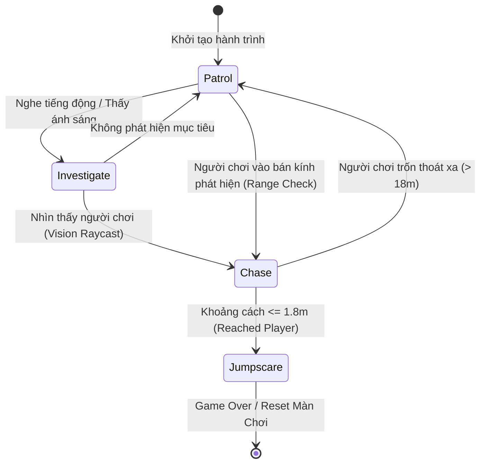
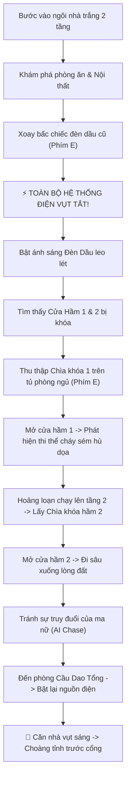

# 📑 NightMare — Game Design & Architecture Document (GDD)

**Dự án**: NightMare (Bóng Đêm Sau Cánh Cửa)  
**Tác giả & Lead Developer**: Jos Nguyen  
**Engine**: Unity 3D  
**Ngôn ngữ**: C# (.NET)  

---

## 🎯 1. Tổng Quan & Định Hướng Thiết Kế (Overview)

NightMare là trò chơi kinh dị góc nhìn thứ nhất 3D (First-Person Horror) tập trung vào yếu tố giật gân, giải đố không gian hẹp và sinh tồn trước thực thể AI săn lùng.

### Phím Điều Khiển Trong Game:
- `WASD`: Di chuyển nhân vật.
- `Left Shift`: Chạy nhanh (Sprint).
- `E`: **Nhặt / Tương tác / Xem chi tiết vật phẩm** (Inspect Item 360°).
- `Q`: **Bỏ vật phẩm xuống** (Drop / Put Away Item).
- `Mouse`: Xoay góc nhìn 3D.

---

## 🧠 2. Thuật Toán AI Ma Nữ (NavMesh Pursuit State Machine)

Thực thể ma nữ trong game được điều khiển bởi hệ thống **NavMeshAgent** với 4 trạng thái cốt lõi:



---

## 🧩 3. Luồng Giải Đố & Tiến Trình Cốt Truyện (Puzzle Flowchart)



---

## 🛠️ 4. Cấu Trúc Mã Nguồn & Tương Tác System (Architecture)

```text
Assets/_Project/Scripts/
├── Player/
│   └── FirstPersonController.cs   # Di chuyển WASD, Mouse Look, HeadBobbing, Footsteps
├── AI/
│   └── NPCChasePlayer.cs          # NavMeshAgent AI, Pursuit, Mixamo Animation BlendTree
├── Interaction/
│   ├── IInteractable.cs           # Interface định nghĩa OnInspect(), OnDrop(), OnInteract()
│   └── InspectSystem.cs           # Xử lý phím [E] xem vật phẩm 360° & phím [Q] bỏ xuống
└── Mechanics/
    ├── ITOLightSwitch.cs          # Hệ thống Đèn Dầu & Sự cố nổ cầu chì
    └── DoorSystem.cs              # Khóa cửa, tra chìa khóa ID & Mở cửa mượt mà
```

---
*Tài liệu thuộc sở hữu của Jos Nguyen — NightMare Game Project.*
